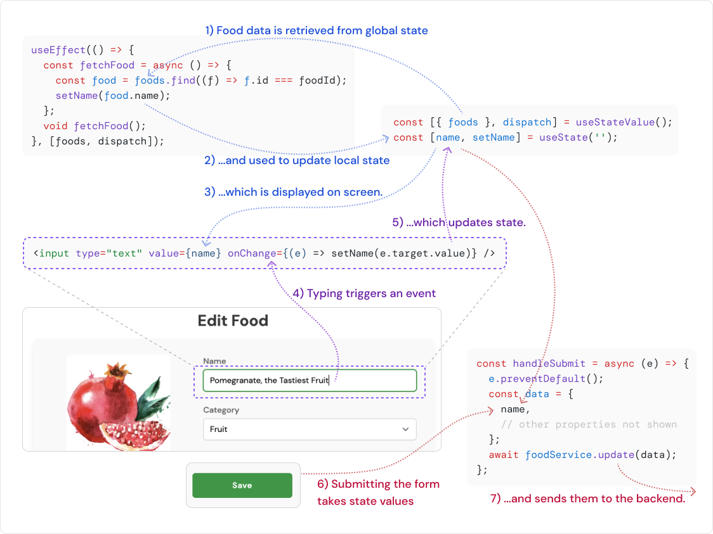
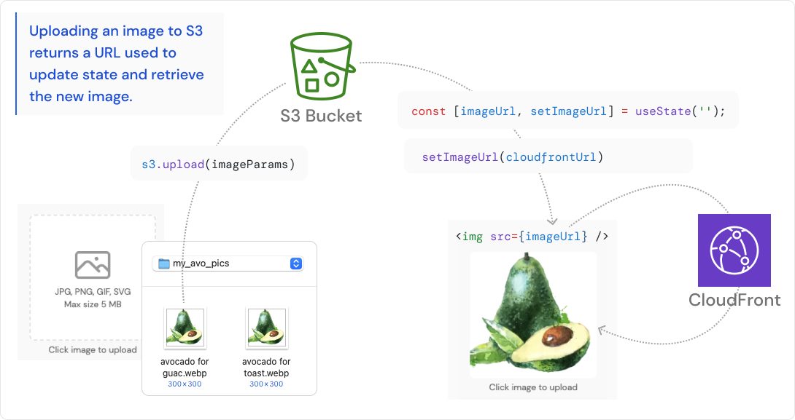
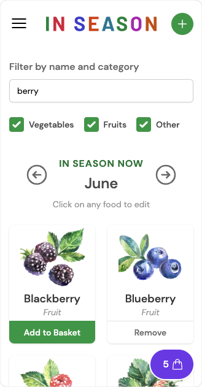
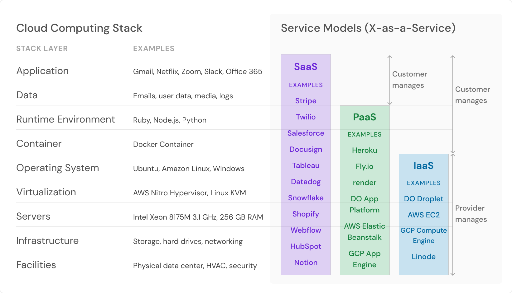

https://in-season-now.com/ (now disabled, after AWS Free Tier expiration)

In Season is an app for checking what fruits and vegetables are in season right now. There's a Basket feature that serves as a shopping list. Initial data is for Southern California, but with an account you can customize food details.

I built this app in Launch School, between the Core and Capstone phases. My goal was to use Just-in-Time Learning to pick up a handful of tools and concepts, and integrate them into a personal project. I wrote about my experience here: [Article](https://medium.com/@jasonherngwang/using-jit-learning-to-build-an-app-during-launch-schools-capstone-prep-2a67e2023454)

Repositories: [Frontend](https://github.com/jasonherngwang/in-season-frontend), [Backend](https://github.com/jasonherngwang/in-season-backend), [Docker Compose](https://github.com/jasonherngwang/in-season), [Images (Docker Hub)](https://hub.docker.com/repositories/jasonherngwang)

## Project Learning Goals

- Collaborate with Capstone teammates to JIT learn new topics together
- Improve timeboxing and work scope estimation skills
- Build UI with React and Router; practice various hooks
- Create a mobile-first design with Tailwind CSS
- Build API with Express
- Use TypeScript on frontend and backend
- Write integration tests with Jest, E2E tests with Cypress
- Compare relational and document models; setup database with with MongoDB and Mongoose
- Configure Docker containers and coordinate with Docker Compose
- Brush up on networking skills; deploy on EC2 instance with Nginx reverse proxy
- Store images in S3 and distribute via CloudFront; practice AWS SDK

## Diagrams

### App Architecture

### State Management for Forms

### Image Upload Feature

### Mobile-First Design

### Cloud Computing Stack

